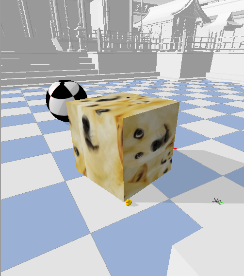
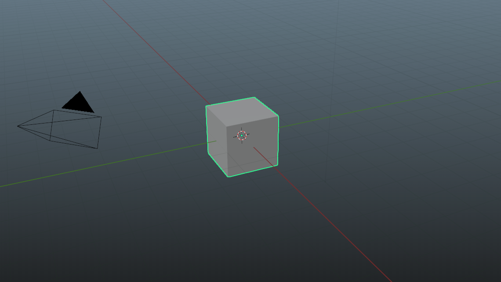
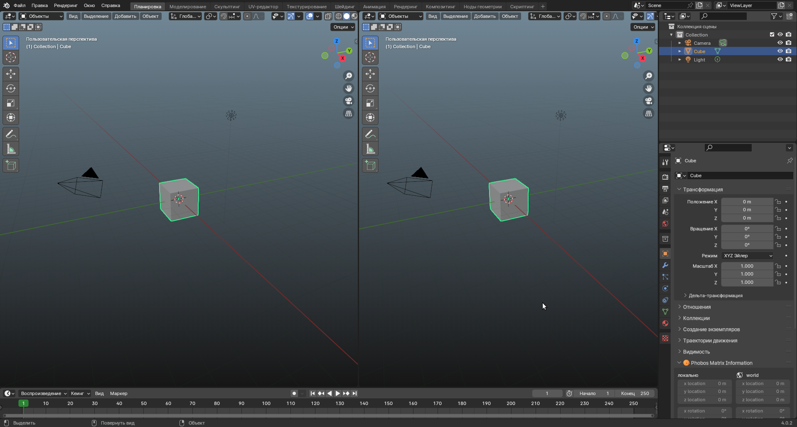
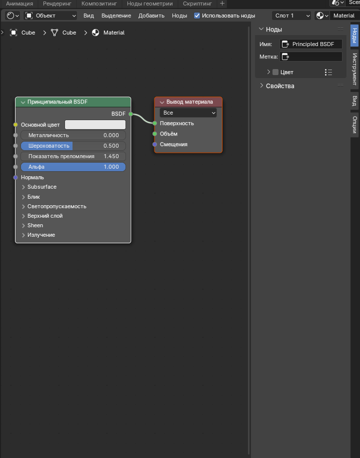
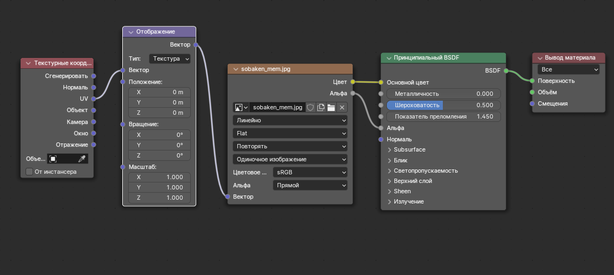
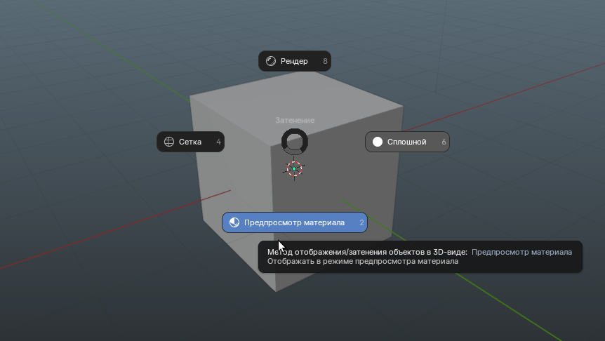
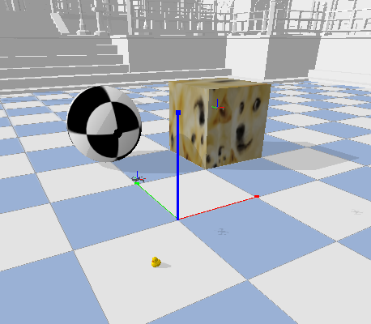

# Добавление куба с простой тектурой

В этой файле описано добавление вот такого объекта в окружение BaseAviary



## Создание объекта в blender

При открытии blender создается объект по умолчанию, который представляет собой куб 1х1х1



Чтобы добавить текстуру на объект, нужно открыть вкладку с материалами в правом окне blender


Далее разделяем рабочую область, для того, чтобы было удобнее наблюдать за изменением объекта, для этого наводим курсор на перекресток вверху между рабочей областью и окном со списком объектов, курсор должен выглядеть как "прицел"


Тянем влево, получаем следующее



Выбираем в одной из областей режим "Редактор шейдеров", должна открыться вкладка с нодами



Для добавления картинки в качестве текстуры нужно добавить 3 ноды (Добавить), а именно ноды Текстура->Изображение-текстура, Вектор->Отображение и Ввод->Текстурные координаты. Добавленные ноды соединяем следующти образом



Переходим на рабочую область с объектом, зажимаем z (важно чтообы была включена английская раскладка) и тянем мышь вниз, выбирая пункт Предпросмотр материала



В результате на кубе должна повяиться тектура из растянутой добавленной картинки.
Жмем Файл->Экспортировать->(.obj), выбираем папку, там должны появиться файлы .obj и .mtl


## Создание .urdf файла

Создаем стандартный текстовый файл, указываем расширение .urdf
Скопируем туда простейший пример urdf:

```urdf
<?xml version="1.0" ?>
<robot name="cube">
  <link name="baseLink">
    <contact>
      <lateral_friction value="1.0"/>
      <rolling_friction value="0.0"/>
      <contact_cfm value="0.0"/>
      <contact_erp value="1.0"/>
    </contact>
    <inertial>
      <origin rpy="0 0 0" xyz="0 0 0"/>
       <mass value="1.0"/>
       <inertia ixx="1" ixy="0" ixz="0" iyy="1" iyz="0" izz="1"/>
    </inertial>
    <visual>
      <origin rpy="0 0 0" xyz="0 0 0"/>
      <geometry>
	<mesh filename="your_obj_filename.obj" scale=".5 .5 .5"/>
      </geometry>
      <material name="Your_Material_Name">
        <texture filename="your_texture_filename.jpg"/>
      </material>
    </visual>
    <collision>
      <origin rpy="0 0 0" xyz="0 0 0"/>
      <geometry>
	 <box size="1 1 1"/>
      </geometry>
    </collision>
  </link>
</robot>
```

Далее нужно немного отредактировать скопированный код:
- Изменяем название .obj файла на название созданного с помощью blender
- Изменяем название материала в строке 20 примера в двойных кавычках на название из .mtl файла (указано после слова newmtl в созданном ранее .mtl файле)
- Изменяем название .jpg файла, вставляем название своего файла с картинкой (расширение можно заменить на .png) в строке 21 в двойных кавычках

Сохраняем изменения, urdf файл готов!

## Добавление файла в окружение

Далее нужно добавить файл в наше окружение. Для простоты будем добавлять объект в BaseAviary для отображения с помощью запуска примера типа downwash.
Чтобы добавить объект в окружение, нужно найти метод _addObstacles в файле BaseAviary.py (находится по пути gym-pybullet-drones->envs). В конец метода нужно дописать следующее:

```python
p.loadURDF(pkg_resources.resource_filename('gym_pybullet_drones', 'your_urdf_path/urdf_file.urdf'),
           [1.5, 1.5, .5],
           p.getQuaternionFromEuler([0, 0, 0]),
           physicsClientId=self.CLIENT
           )
```

Тут вместо your_urdf_path нужно вставить путь к вашему urdf файлу (полный или относительный путь в проекта), а вместо urdf_file название urdf файла, который нужно добавить. Вторым аргументом передается положение объекта в окружении, меняя значения в скобках, мы меняем координаты объекта. 
Сохраняем изменения и запускаем, например, файл downwash.py (по пути gym-pybullet-drones->examples)
Должно получиться примерно следующее:



Таким образом, мы добавили объект с простой текстурой в наше окружение!
В папке Examples вы можете увидеть пример созданного объекта и добавить его в проект.

