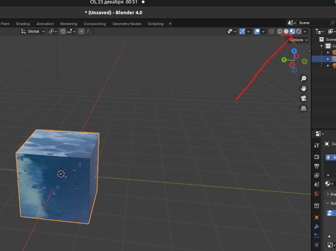

# Добавление текстуры в симуляцию
## Добавление текстуры при помощи ChangeVisualShape в коде симуляции
```python
c = p.loadURDF('cube.urdf',

					[-.1, 0, .1],
					
					p.getQuaternionFromEuler([0, 0, 0]),
					
					globalScaling=1,
					
					physicsClientId=PYB_CLIENT
					
					)

x = p.loadTexture('tag.png')

p.changeVisualShape(c, -1, textureUniqueId=x)

# -1 value is "link index"

#(link index has something to do with "joints", of which the cube apparently has none)
```
Данный способ работает не со всеми изображениями, причина такого поведения пока неизвестна
	В данном случае изображение будет добавлено на все стороны куба


## Добавление текстуры при помощи связки URDF+OBJ+MTL
1. В блендере нужно открыть вкладку материалов
	
2. Нажать New чтобы создать новый материал
3. Нажать на кружок рядом с Base color и выбрать texture image
	
4. При помощи open открыть нужное изображение
	
5. Убедиться, что Display mode выставлен на Material Preview (иначе текстуру не будет видно, по умолчанию отображаются лишь геометрические формы)
	
 	
6. Кликнув на левый верхний угол и задерживая кнопку мыши, тянуть вправо чтобы раздвоить экран.
7. Сменить editor type в левом верхнем углу на UV editor
	
8. Выбрать добавленное изображение в UV editor
	
	
9. В 3д редакторе выделить куб и нажать Tab, в результате слева должно появиться разделение изображения на области, которые будут видны на гранях куба.
	
 	Если граней не видно, см п.9
	
10. Убедиться, что включена синхронизация и режим выбора граней
	
11. Расположить желаемую часть изображение на одной из граней (Связи между областями можно разорвать при помощи Rip region).
	
 	
	
 	Обратите внимание на ориентацию куба на следующем скриншоте
	
	
 	Обратите внимание на ориентацию куба в пространстве в правом верхнем углу, (верхняя грань в блендере не будет являться верхней гранью куба в симуляции).
	
 	Нужно изменять текстуру на грани, нормалью которой будет вектор -oY, именно эта грань будет верхней гранью в симуляции
12. Экспортировать в качестве obj файла (убедитесь, что выбрано Export Materials)
	
13. В urdf файле в mesh filename указать имя obj файла, в Material указать такое же имя материала как в Блендере, в texture filename указать имя изображения
	
 	Urdf файл загружен в репозиторий
 	
14. В симуляции загрузить созданный urdf file
```python
c = p.loadURDF('cube.urdf',

					[-.1, 0, .1],
					
					p.getQuaternionFromEuler([0, 0, 0]),
					
					globalScaling=1,
					
					physicsClientId=PYB_CLIENT
					
					)
```

